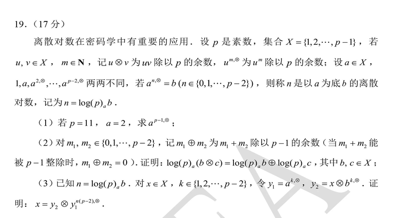
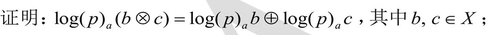
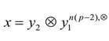

## 1、前言

如果说数学能让人破防，那么对我而言可以称得上“梦魇”的就是2024年九省联考的第17题了。直到学习了密码学，我才真正看懂这道题目，不得不说，这道题需要的数论基础知识并不少，有些很显而易见，但如果没有任何数论基础是很难从0想到的。

## 2、前置知识：数论

（该部分由AI生成）

### 2.1 先认识同余

设 \(a,b,m\) 都是整数，并且 \(m>0\)。

如果 \(a-b\) 能被 \(m\) 整除，就称 \(a\) 与 \(b\) 模 \(m\) 同余，记作：

$$
a\equiv b\pmod m
$$

也就是说：

$$
\boxed{a\equiv b\pmod m\iff m\mid(a-b)}
$$

---

### 2.2 同余的性质

**Ⅰ自反性：**

$$
\boxed{a\equiv a\pmod m}
$$

**Ⅱ 对称性：**

如果：

$$
a\equiv b\pmod m
$$

那么：

$$
\boxed{b\equiv a\pmod m}
$$

**Ⅲ 传递性：**

如果：

$$
a\equiv b\pmod m
$$

并且：

$$
b\equiv c\pmod m
$$

那么：

$$
\boxed{a\equiv c\pmod m}
$$

**Ⅳ 同余的运算性质**

如果：

$$
a\equiv b\pmod m
$$

并且：

$$
c\equiv d\pmod m
$$

那么有以下性质：

1. 加法

$$
\boxed{a+c\equiv b+d\pmod m}
$$

2. 减法

$$
\boxed{a-c\equiv b-d\pmod m}
$$

3. 乘法

$$
\boxed{ac\equiv bd\pmod m}
$$

4. 乘方

对于正整数 \(n\)：

$$
\boxed{a^n\equiv b^n\pmod m}
$$

5. 同乘一个整数

对于任意整数 \(k\)：

$$
\boxed{ka\equiv kb\pmod m}
$$

---

### 2.3 费马小定理

如果 \(p\) 是质数，并且 \(a\) 不是 \(p\) 的倍数，那么：

$$
\boxed{a^{p-1}\equiv1\pmod p}
$$

例如 \(p=7\)，\(a=2\)：

$$
2^{7-1}=2^6\equiv1\pmod7
$$

因为：

$$
2^6=64
$$

而：

$$
64\div7
$$

余 1。

也可以写成：

$$
\boxed{a^p\equiv a\pmod p}
$$

---

### 2.4 什么时候能使用

使用：

$$
a^{p-1}\equiv1\pmod p
$$

需要满足两个条件：

1. 模数 \(p\) 是质数；
2. \(a\) 不是 \(p\) 的倍数。

例如：

$$
3^{100}\pmod7
$$

7 是质数，3 不是 7 的倍数，因此可以使用费马小定理。

但是：

$$
2^{100}\pmod6
$$

不能直接套费马小定理，因为 6 不是质数。

---

### 2.4 基本解题方法

要求：

$$
a^n\pmod p
$$

其中 \(p\) 是质数。

由费马小定理：

$$
a^{p-1}\equiv1\pmod p
$$

把指数 \(n\) 除以 \(p-1\)：

$$
n=q(p-1)+r
$$

那么：

$$
a^n=a^{q(p-1)+r}
$$

$$
a^n=(a^{p-1})^q a^r
$$

模 \(p\) 后：

$$
a^n\equiv1^q a^r
$$

所以：

$$
\boxed{a^n\equiv a^r\pmod p}
$$

其中：

$$
r=n\bmod(p-1)
$$

简单说：模数是质数时，可以把指数对 \(p-1\) 取余。

## 3、正式解题

### 3.1 题目

简单看一眼题目的新定义：题目规定：

①
$$
u\otimes v
$$

表示 \(uv\) 除以 \(p\) 的余数，也就是：

$$
u\otimes v\equiv uv\pmod p
$$

即该符号表示：u和v的乘积除以p得到的余数

②
$$
u^{m,\otimes}
$$

表示 \(u^m\) 除以 \(p\) 的余数，也就是：

$$
u^{m,\otimes}\equiv u^m\pmod p
$$

即该符号表示：u的m次方除以p得到的余数

③

若：

$$
a^{n,\otimes}=b
$$

则：

$$
n=\log(p)_ab
$$

即n表示：满足a的n次方除以p的余数是b。

### 3.2 第一问

求：
$$
x=2^{10,\otimes} ,p=11\\
$$
可以根据概念直接求，手算并不复杂：
$$
\\
2^{10}=1024\\
1024÷11=93……1\\
$$
故得到结果：
$$
\\x=2^{10,\otimes}\equiv1024\equiv1\mod11\\
\boxed {x=1}\\
$$
**<u>（当时写这个题目没看出来有什么意味，复盘的时候才发现原来是“费马小定理”，在第二问中有用）</u>**

### 3.3第二问

①先看新的定义：
$$
\\m_1\oplus m_2\equiv(m_1+m_2)^{(p-1),\otimes}\equiv(m_1+m_2)\mod (p-1)\\
$$
即该符号表示两个数相加的和除以(p-1)的余数。

②题目要求我们

此时我们可以进行代换操作，不妨设
$$
\\
\log(p)_a(b\otimes c)=x_1\\
\log(p)_a b=x_2\\
\log(p)_a c=x_3\\
$$
根据定义可知他们满足以下条件：
$$
\\
a^{x_1}\equiv bc\mod p\\
a^{x_2}\equiv b\mod p\\
a^{x_3}\equiv c\mod p\\
$$
根据我们上面提到的同余的乘法的性质：
$$
a^{x_2}a^{x_3}\equiv a^{x_2+x_3}\equiv bc \mod p\\
$$
再根据传递的性质，我们可知：
$$
a^{x_1}\equiv a^{x_2+x_3} \mod p
$$
即
$$
a^{x_1,\otimes}=a^{x_2+x_3,\otimes}
$$

③我们根据余数的性质可以知道，任何一个数除以p的余数都在0~(p-1)之间，而a是与p互质的，a的任意次方都不可能是p的倍数，所以a的任意次方除以p的余数只可能在1~(p-1)之间，再根据题目可知：
$$
a^{0,\otimes}(=1),a^{1,\otimes},……a^{p-2,\otimes}
$$
两两互不相同，我们可以考虑鸽笼原理，当出现
$$
a^{p-1,\otimes}
$$
的时候，它一定会和以上p-1个数中的一个相等，<u>**（根据第一问，我们可以猜出来，这个数是1）即费马小定理**</u>：
$$
\\a^{p-1,\otimes}\equiv a^{0,\otimes} \equiv1 \mod p\\
$$
那么剩下的数据会满足：
$$
a^{p}\equiv a^{p-1}a \equiv 1·a \equiv a\mod p\\
$$
则满足：
$$
\\
a^{p,\otimes}=a^{1,\otimes}\\
a^{p+1,\otimes}=a^{2,\otimes}\\
a^{p+2,\otimes}=a^{3,\otimes}\\
……\\
$$
由此我们可以知道，这个函数
$$
f(x)=a^{x,\otimes}
$$

是一个以(p-1)为周期的函数

④刚才已经得到这个公式：
$$
\\a^{x_1,\otimes}=a^{x_2+x_3,\otimes}\\
f(x_1)=f(x_2+x_3)\\
$$
又已知了这个函数是有周期的，所以满足：
$$
x_1=(x_2+x_3)+k·(p-1)\\
$$
那么：
$$
[x_1-(x_2+x_3)]\mid (p-1)\\
$$
由余数的性质可知：
$$
x_1\equiv(x_2+x_3) \mod (p-1)\\
$$
根据该题最开始的定义，我们可以知道：
$$
x_1=x_2\oplus x_3\\
$$
把这三个数全部带回初始假设，我们就得到了题目要求证明的内容。**<u>（这个对于第三问也有很大作用）</u>**
$$
\\\boxed{\log(p)_a(b\otimes c)=\log(p)_a b \oplus \log(p)_a c}
$$

### 3.4第三问

①如果我们想证明

我们可以从离散对数问题出发：

我们可以看到等式左边
$$
x \in X
$$
而等式右边是取模之后的结果，也满足
$$
y_2\otimes y_1^{n(p-2),\otimes} \in X\\
$$
而我们知道：
$$
a^{0,\otimes}(=1),a^{1,\otimes},……a^{p-2,\otimes}
$$
两两互不相同，则如果要证明：
$$
x=y_2\otimes y_1^{n(p-2),\otimes}
$$
我们就可以选择去证明等式左右两边的数对应的离散对数是相等的。

②**<u>可以根据我们第二问证明的结论</u>**，带入题目的条件：
$$
\\
\log(p)_a(y_2\otimes y_1^{n(p-2),\otimes})\\
=\log(p)_ay_2\oplus \log(p)_ay_1^{n(p-2),\otimes}\\
=\log(p)_a(x\otimes b^{k,\otimes})\oplus \log(p)_ay_1^{n(p-2),\otimes}\\
=\log(p)_ax\oplus \log(p)_ab^{k,\otimes}\oplus \log(p)_ay_1^{n(p-2),\otimes}\\
$$
由于一般的加法有结合律，他们取余之后结果依然相同，所以同余的加法也有结合律，所以我们可以先计算后面两个数的结果

不妨设：
$$
x_1=\log(p)_ab^{k,\otimes} ,x_2=\log(p)_ay_1^{n(p-2),\otimes}
$$
根据题目可知：
$$
\\
y_1\equiv a^k \mod p\\
b\equiv a^n \mod p\\
$$
根据定义和假设可知：
$$
\\
a^{x_1}\equiv b^k \equiv a^{n·k}\mod p\\
a^{x_2}\equiv y_1^{n(p-2)}\equiv a^{k·n(p-2)} \mod p\\
$$
所以
$$
a^{x_1+x_2}\equiv a^{x_1}a^{x_2} \equiv a^{nk+nk(p-2)} \equiv a^{nk(p-1)} \mod p\\
$$
即
$$
a^{x_1+x_2,\otimes}=a^{nk(p-1),\otimes}\\
$$
根据第二问得到的结论：这个函数是周期为(q-1)的函数，所以：
$$
\\
x_1+x_2=nk(p-1)+k_0(p-1)=k'(p-1)\\ =>
(x_1+x_2) | (p-1)\\=>
(x_1+x_2) \equiv 0 \mod (p-1)\\=>
x_1\oplus x_2 =0\\
$$
③把这个式子带入回去：
$$
\\\log(p)_a(y_2\otimes y_1^{n(p-2),\otimes})\\
=\log(p)_ay_2\oplus \log(p)_ay_1^{n(p-2),\otimes}\\
=\log(p)_a(x\otimes b^{k,\otimes})\oplus \log(p)_ay_1^{n(p-2),\otimes}\\
=\log(p)_ax\oplus \log(p)_ab^{k,\otimes}\oplus \log(p)_ay_1^{n(p-2),\otimes}\\
=\log(p)_ax\oplus (x_1\oplus x_2)\\
=\log(p)_ax\oplus 0\\
=\log(p)_ax\\
$$
两边同时对a取指再取模，就可以得到
$$
\boxed{x=y_2\otimes y_1^{n(p-2),\otimes}}
$$

## 4、总结

这道题目很难，但很巧妙。

难在“信息差”上，同余的性质对于一个没有学过数论的高中生是很难自己想出来的，而在二三两问的证明中多次使用同余的性质，并且第二问的证明某种程度上需要知道“费马小定理”，对于没有接受过竞赛培训或者课外拓展的学生十分不友好；

巧妙就巧妙在他的12问之间以及23问之间均相互联系：

第二问的时候你会发现他的题目给了提示：1.“……两两不同”，2.a和p互质（余数不可能为0），3.小学就学过余数的性质（余数不可能大于除数）。根据2 3条我们可以知道所有的余数结果都在1~(p-1)之中，而第1条则说明，如果我们把这个新定义的符号看成函数，那么这个函数的前(p-1)项都是不相等的，也就是说，从第p项开始，就会出现重复，那么第p项对应的
$$
a^{p-1,\otimes}
$$
这个数应该对应的是哪个数呢，我们就可以**<u>根据第一题给的提示</u>**，大胆猜出来，它就是等于1，也就是第1项的
$$
a^{0,\otimes}
$$
如果这时候我们大胆了，那么下面我们不妨更大胆猜：那么就是这个函数他就是一个周期函数，并且根据我们得到的内容，这个周期他就是(p-1)，如果你有这么大“胆量”，这个题目即使你不知道“费马小定理”也无妨，因为他其实本质上是一个周期函数，并且题目已经暗示了周期。

第三问的时候虽然他写了一堆“代号”，但其实思路就是“逆向”，即我们第二问证明了这个带log的等式，现在第三问没有这个log符号，我们能否通过一些操作让这个log出现，而log出现之后，右边的“圈乘号”就出现在log里，这时就可以**<u>使用第二问证明过的结论</u>**了。

复盘完成之后不得不感叹出题人的“提示”，但对于这个“提示”我还是想说，这些全部的提示都要建立在大家有对同余性质的把握，当大部分学生对于同余的性质都未知的时候，这道题目的23问着实是十分艰难的，如果出的更简单一点，我可能会把第一问改成两小问，现在的第一问挪到第一大问的第二小问，第一小问是更简单的一道题目，类似于a=b mod p  c=d mod p ,求ac mod p 的值（这里的a b c d p都可以设置成具体值）目的是让大家发现同余的性质，这样或许大家的思路会更开阔一点。并且第一问”送的分“还能多一点。~~让大家从99.99%的绝望变成99.98%的绝望。~~

## 5、额外想说的

这道题说是梦魇是因为当年作为高三学生，坐在考场里发现题型有变化，然后倒数第二题是很难的圆锥曲线，倒数第一题又是这道“朝纲”题，以至于我写完前面的题剩下了一个小时，而剩下的一个小时里面这两道题没有一道甚至一小问（除去第一问这种送分的）是写出来的。而且这次考试结束之后，题型也是真的变了，对于一个6月初要高考的学生，在1月底告诉我们要改数学题型，中间还有寒假和过年，真正的准备时间不到5个月，无疑是一次巨大的打击。